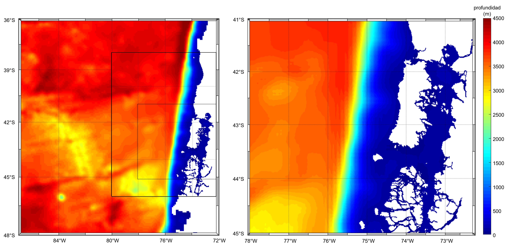

# ¡Hola! Soy Gabriela Oyarzo Escudero 👋 | Gabi

### 📊 Analista de Datos | Consultora en Gestión y Logística
📍 Viña del Mar, Chile

## 🚀 Sobre mí
Soy **Oceanógrafa** de profesión y actualmente curso un **Magíster en Simulación Computacional**. Mi enfoque combina el rigor científico con la capacidad de simulación estratégica para abordar los datos y orientarlos a resultados concretos en el mundo corporativo. 

Me destaco por mi perfil autodidacta y mi orientación a la optimización. Tengo sólida experiencia en la automatización de procesos, estructuración de bases de datos y en la consultoría de gestión y logística para empresas privadas, donde busco constantemente minimizar el error humano mediante la digitalización de registros y flujos de trabajo.

## 🛠️ Herramientas y Tecnologías
Disfruto construyendo soluciones eficientes, lógicas y visualmente estructuradas utilizando:
* **Análisis de Datos y Visualización:** SQL, Power BI, Excel.
* **Programación:** Matlab, Python.
* **Documentación y Control de Versiones:** Office, Git, GitHub.

# 🚀 Proyectos🌊 

Tesis: : Respuesta hidrodinámica a la variabilidad sinóptica del viento a lo largo de la costa en la Patagonia Norte y su efecto en el mar interior de Chiloé.
Recursos: 
- Simulación de Grillas Anidadas (CROCO)
Figura: Grilla doble anidado para simulación CROCO en Patagonia Norte. Este trabajo de tesis de pregrado utiliza el modelo CROCO para realizar simulaciones oceanográficas, empleando una estructura de grillas anidadas (Padre, Hijo y Nieto) que permite aumentar la resolución espacial en zonas críticas de la Patagonia Chilena.

<table border="0"><tr>
  <td align="center">
  
   Modelo Anidado 
  </td>
</table>

## 🔗 Conectemos
* **LinkedIn:** [gabioyarzoe](https://www.linkedin.com/in/gabioyarzoe)
* **Email:** gabioyarzoe@gmail.com
* **GitHub:** [GabiOyarzo](https://github.com/GabiOyarzo)
